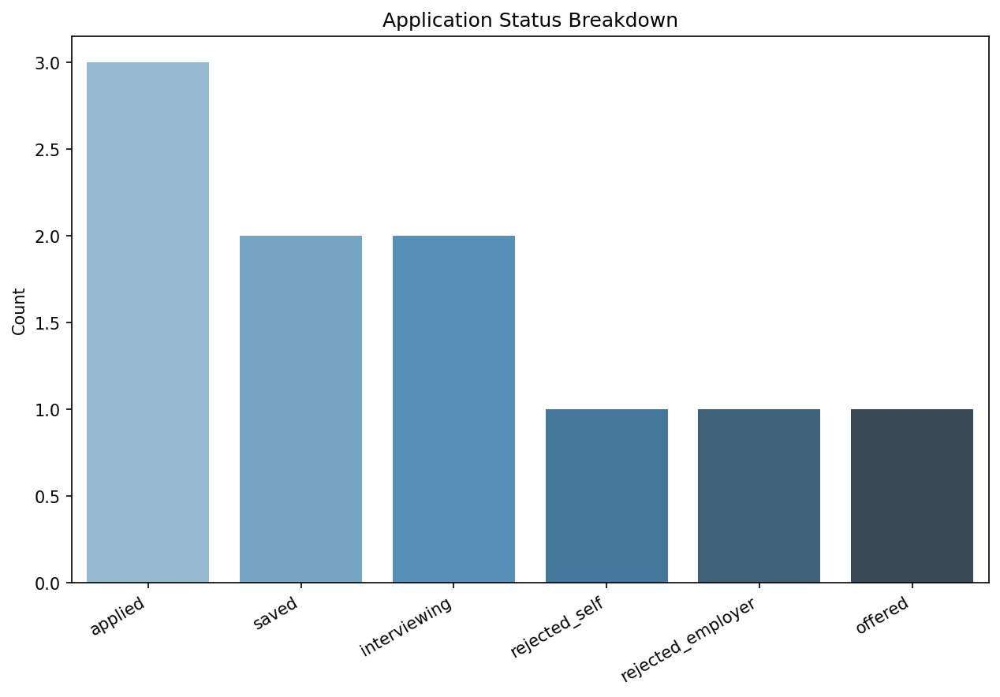
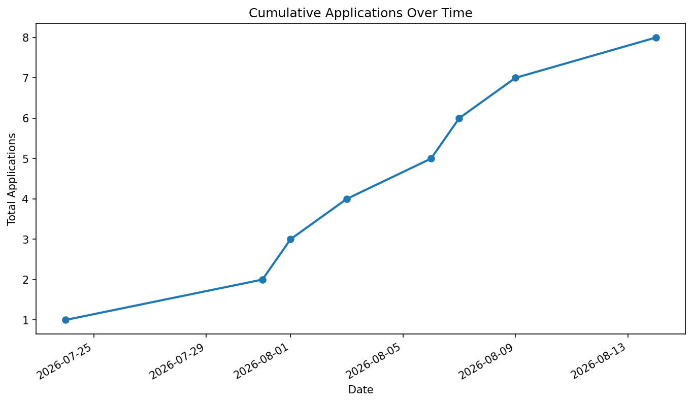
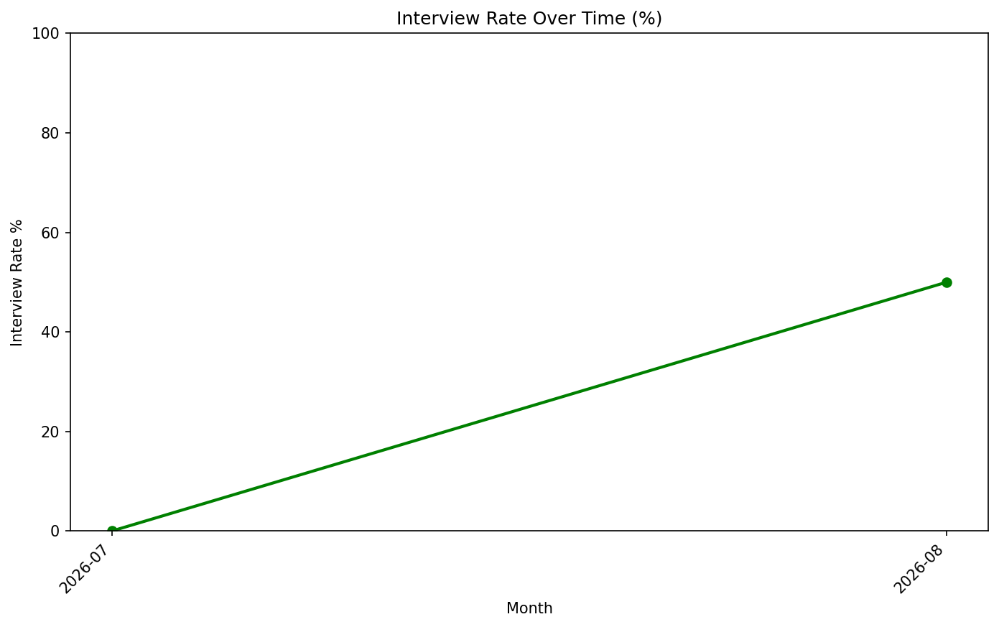
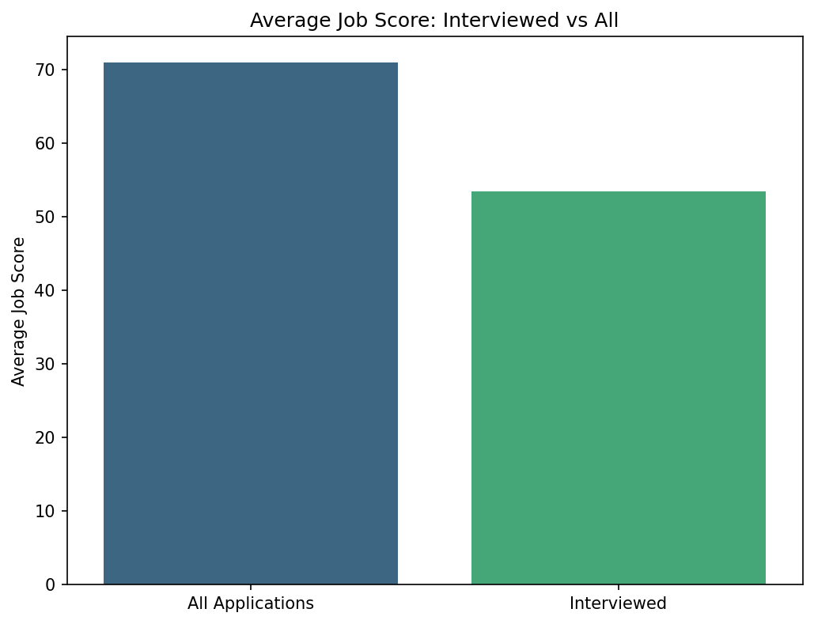
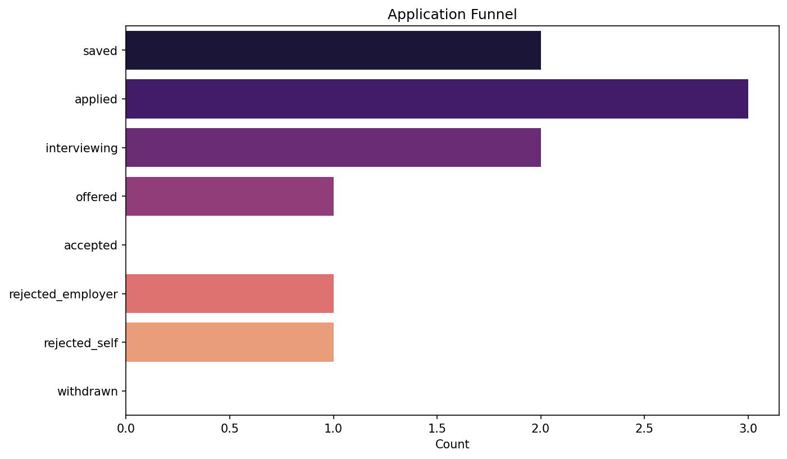

# Star Hound Tracker

<p align="center">
  
</p>

## Local-first Job Search Tracker 

Score opportunities, manage your application pipeline, and (later) generate tailored resumes and weekly reports.

**Author:** William Slider  
**Status:** Early development / Version 1 in progress  
**Current focus:** Core modules complete · sample data + visualizations next  
**License:** MIT

---

## Overview

Star Hound Tracker helps you:

- Log and score job opportunities
- Track applications from saved → applied → interview → offer
- Factor in pay, commute, and fit when prioritizing
- Avoid re-applying to rejected roles
- Visualize progress over time

Everything runs locally. Your data stays on your machine.

**Architecture:** SQLite is the source of truth. pandas + matplotlib/seaborn are used for analysis, plots, and reports.

---

## Features

### Version 1 (current target)
- [x] User profile (home location + pay preferences)
- [x] Manual job entry
- [x] Job scoring (pay, weekly commute, manual fit 1–10)
- [x] Remote / hybrid / onsite commute handling
- [x] Application pipeline with clear statuses
- [x] Follow-up reminders
- [x] Basic charts (applications, outcomes, scores)
- [x] SQLite database under `data/` (source of truth)
- [x] CSV backup system
- [x] Sample / demo dataset for testing & README screenshots
- [ ] Complete Jobs Report


### Version 2 (planned)
- [ ] URL / scrape-assisted job intake
- [ ] Expanded skills & preferences profile
- [ ] Tailored resume generation per job
- [ ] Weekly HTML/PDF reports
- [ ] Stronger automated fit signals

---

## Example Outputs

These charts were generated from the included sample dataset (`samples/sample_jobs.db`) featuring the fictional user **Star Hound**.

### Application Status Breakdown


### Cumulative Applications Over Time


### Interview Rate Over Time


### Interview Quality (Average Job Score)


### Application Funnel


---

## Tech stack

- Python 3.14.4
- SQLite (local source of truth via `sqlite3`)
- pandas (query results, analysis, report tables)
- matplotlib / seaborn (charts)
- geopandas
- Jupyter notebook for prototyping

_Optional later:_ scraping libraries, HTML/PDF resume & report tooling

---

## Project structure

```text
├── job_tracker.ipynb              # Prototyping & testing (local)
├── job_tracker.py                 # Main CLI entry point
├── generate_sample_data.py        # Creates demo database + sample data
├── python/
│   ├── db.py                      # Database connection & schema
│   ├── users.py                   # User profile CRUD
│   ├── scoring.py                 # Commute + weighted job score
│   ├── jobs.py                    # Job entry & listing
│   ├── applications.py            # Application pipeline
│   ├── reminders.py               # Follow-up system
│   ├── backup.py                  # CSV backups
│   ├── viz.py                     # Charts (in progress)
│   └── ...
├── data/                          # Real user data (gitignored)
│   └── jobs.db
├── db_backups/                    # Real data CSV backups (gitignored)
├── plots/                         # Real charts (gitignored)
├── resumes/                       # V2 – generated resumes
├── reports/                       # V2 – weekly reports
├── samples/                       # Demo / sample data (safe to commit)
│   ├── sample_jobs.db             # Separate sample database
│   ├── sample_plots/              # Charts generated from sample data
│   ├── sample_backup_data/        # CSV backups of sample data
│   ├── sample_reports/
│   └── sample_resumes/
├── images/
│   └── star_hound_tracker_logo_v1.png
├── requirements.txt
├── LICENSE
└── README.md
```

---

## Setup

```bash
# Clone the repo
git clone <repo-url>
cd star-hound-tracker

# (Recommended) create a virtual environment
python -m venv .venv
source .venv/bin/activate          # Windows: .venv\Scripts\activate

# Install dependencies
pip install -r requirements.txt
```

> `data/`, `plots/`, `db_backups/`, `resumes/`, and `reports/` are created by the program when needed.  
> The real SQLite database is initialized automatically on first run.

---

## Usage

### Main CLI
```bash
python job_tracker.py
```

### Generate sample / demo data
```bash
python generate_sample_data.py
```
This creates a completely separate database at `samples/sample_jobs.db` filled with a fictional user (“Star Hound”) and realistic sample jobs + applications. It never touches your real data.

### Notebook (development)
```bash
jupyter notebook job_tracker.ipynb
```

Typical V1 flow:
1. Set or update your user profile
2. Add jobs manually
3. Move promising roles into the applications pipeline
4. Track status and follow-ups
5. Generate charts when you want a snapshot

---

## Data flow

```text
User input / menu
  → SQL INSERT / UPDATE / SELECT on SQLite
    → pandas (pd.read_sql) for analysis
      → matplotlib / seaborn → plots/ (or samples/sample_plots/)
```

- **Writes and pipeline updates** go through SQLite  
- **Visuals and reports** load query results into DataFrames with pandas  

---

## Scoring (V1)

Jobs are scored from three factors:

| Factor            | Source                                      |
|-------------------|---------------------------------------------|
| Pay               | Listing vs your preferred range             |
| Weekly commute    | Round-trip miles × days in office per week  |
| Fit               | Manual 1–10 match to skills / background    |

Remote roles use `0` commute days. Hybrid uses expected office days.  
Component scores are stored so weights can be tuned later.

---

## Data & privacy

- Real data is stored **locally** in SQLite (`data/jobs.db`)
- Sample / demo data lives in `samples/` and is completely separate
- `data/`, `plots/`, `db_backups/`, `resumes/`, and `reports/` should remain gitignored
- Do not commit personal info, resumes, or scraped listing dumps
- Foreign keys are enforced with `PRAGMA foreign_keys = ON`

---

## Roadmap

**Near term**
- [x] Lock V1 SQLite schemas (`user`, `jobs`, `applications`)
- [x] User profile module
- [x] Scoring + manual job entry
- [x] Application pipeline + follow-ups
- [x] CSV backup system
- [x] Sample dataset for demos & testing
- [ ] First charts (SQL → pandas → plots)

**Later**
- Scrape-assisted intake
- Resume generation
- Weekly reports

---

## Contributing

Personal project for now. Suggestions and issue reports are welcome if the repo is public.

---

## License

MIT License

Copyright (c) 2026 William Slider